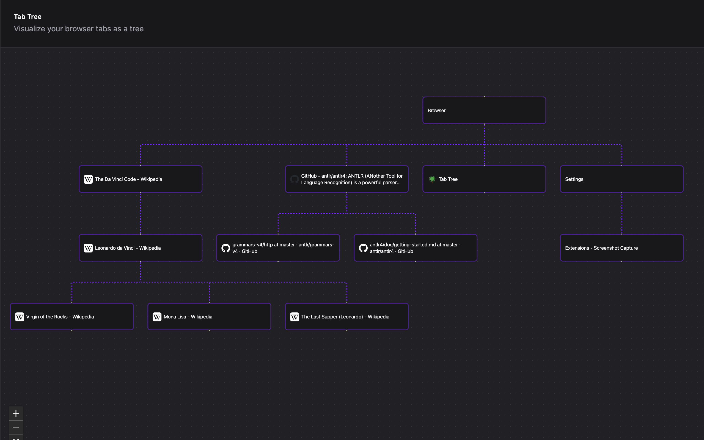

# TabTree

A browser extension that visualizes your open tabs in a tree format, showing parent-child relationships.



## Download

[Chrome](https://chromewebstore.google.com/detail/tab-tree/nhcanjcmbhplkkmjadhckffjjjnhgljj)

## Features

- Visualize tabs as a tree graph
- Shows parent-child relationships based on which tab opened which
- Full-page view (not a popup) for better visibility
- Real-time updates as tabs are opened, closed, or modified
- Click on any node to switch to that tab
- Interactive controls: zoom, pan, minimap

## Installation

### Development

1. Install dependencies:
   ```bash
   npm install
   ```

2. Build the extension for both browsers:
   ```bash
   npm run build:extension
   ```

   This creates two separate builds:
   - `dist-chrome/` - Chrome/Edge build (Manifest V3)
   - `dist-firefox/` - Firefox build (Manifest V2)

3. Load the extension in your browser:

   **Chrome/Edge:**
   - Navigate to `chrome://extensions/`
   - Enable "Developer mode"
   - Click "Load unpacked"
   - Select the `dist-chrome` folder

   **Firefox:**
   - Navigate to `about:debugging#/runtime/this-firefox`
   - Click "Load Temporary Add-on"
   - Select any file in the `dist-firefox` folder

### Production Build

```bash
npm run build:extension
```

This builds browser-specific versions:
- Chrome/Edge: Uses Manifest V3 with service workers (`dist-chrome/`)
- Firefox: Uses Manifest V2 with background scripts (`dist-firefox/`)

## Usage

1. Click the extension icon in your browser toolbar
2. A new tab will open displaying your tab graph
3. The graph shows:
   - Each tab as a node with its title
   - Connections between tabs (parent → child)
   - Root tabs (tabs not opened by other tabs) at the top
4. Click any node to switch to that tab

## Development

To run in development mode with hot reload:

```bash
npm run dev
```

Note: For browser extension features to work, you'll still need to build and load the extension in your browser.

## How It Works

1. **Background Service Worker** (`src/background.js`):
   - Tracks all tab events (creation, updates, removal)
   - Maintains a tree structure of tab relationships using `openerTabId`
   - Stores the tab tree in browser storage

2. **Main App** (`src/App.svelte`):
   - Loads the tab tree from storage
   - Converts it to nodes and edges for Svelteflow
   - Displays the graph with interactive controls
   - Updates in real-time when tabs change

3. **Manifest** (`public/manifest.json`):
   - Defines extension permissions (tabs, storage)
   - Configures the background service worker
   - Sets up the extension icon and action

## Configuration & Sizes Reference

### Node Dimensions

All nodes have fixed dimensions to ensure consistent layout spacing.

**Location:** `src/App.svelte`
```typescript
const NODE_WIDTH = 450;   // Width in pixels
const NODE_HEIGHT = 80;   // Height in pixels
```

**Location:** `src/lib/TabNode.svelte`
```html
style="width: 450px; height: 80px;"
```

> **⚠️ Important:** When changing node dimensions, update BOTH files:
> 1. Update `NODE_WIDTH` and `NODE_HEIGHT` constants in `src/App.svelte`
> 2. Update the inline `style` attribute in `src/lib/TabNode.svelte` to match exactly

### Node Styling

**Location:** `src/lib/TabNode.svelte`

| Property | Class/Style | Value | Description |
|----------|------------|-------|-------------|
| Border width | `border-2` | 2px | Border thickness |
| Border color | `border-accent` | shadcn accent | Default border |
| Hover border | `border-foreground` | shadcn foreground | Hover state |
| Border radius | `rounded-lg` | 8px | Corner rounding |
| Padding horizontal | `px-4` | 16px | Left/right padding |
| Padding vertical | `py-3` | 12px | Top/bottom padding |
| Text size | `text-lg` | ~18px | Font size |
| Favicon size | `w-4 h-4` | 16px × 16px | Icon dimensions |
| Box sizing | `box-border` | border-box | Includes border/padding in dimensions |

### Layout Spacing

**Location:** `src/App.svelte` - `convertTabTreeToGraph()` function

```typescript
g.setGraph({
  rankdir: "TB",     // Layout direction: Top-to-Bottom
  ranksep: 150       // Vertical spacing between levels (pixels)
});
```

| Parameter | Current Value | Description |
|-----------|--------------|-------------|
| `rankdir` | `"TB"` | Layout direction (TB = top-to-bottom, LR = left-to-right) |
| `ranksep` | `150` | Vertical distance between parent and child levels (in pixels) |

> **Note:** Horizontal spacing is automatically calculated by Dagre based on the number of nodes at each level.

### Edge Styling

**Location:** `src/App.svelte`

**Inline style (per edge):**
```typescript
style: "stroke-width: 3;"  // Edge line thickness in pixels
```

**Global CSS styling:**
```css
:global(.svelte-flow__edge-path) {
  stroke: hsl(var(--foreground)) !important;  // Uses shadcn foreground color
  stroke-opacity: 0.5 !important;             // 50% transparency
}
```

| Property | Value | Description |
|----------|-------|-------------|
| Stroke width | `3px` | Edge line thickness |
| Stroke color | `hsl(var(--foreground))` | Uses shadcn foreground color variable |
| Stroke opacity | `0.5` | 50% transparency for subtle appearance |

### Theme Colors (shadcn)

The app uses shadcn's semantic color tokens which automatically adapt to light/dark mode:

| Token | Usage | Description |
|-------|-------|-------------|
| `bg-background` | Node background | Main background color |
| `text-foreground` | Node text | Primary text color |
| `border-border` | Default border | Standard border color |
| `border-accent` | Node border | Accent/highlight color |
| `border-foreground` | Hover border | Foreground color for emphasis |

These color variables are defined in `src/app.css` and automatically switch between light and dark values based on the theme.

### Card & UI Spacing

**Location:** `src/App.svelte`

| Element | Class | Value | Description |
|---------|-------|-------|-------------|
| Theme button padding | `p-2` | 8px | Button padding all sides |
| Theme icon size | `w-5 h-5` | 20px × 20px | Sun/Moon icon dimensions |
| Card | shadcn default | - | Uses shadcn Card component spacing |

### Quick Reference: Common Changes

**To make nodes bigger:**
1. Change `NODE_WIDTH` and `NODE_HEIGHT` in `src/App.svelte`
2. Update `style="width: ...px; height: ...px;"` in `src/lib/TabNode.svelte`
3. Rebuild: `npm run build:extension`

**To increase vertical spacing between levels:**
1. Increase `ranksep` value in `src/App.svelte` (e.g., from 150 to 200)
2. Rebuild: `npm run build:extension`

**To change edge thickness:**
1. Modify `stroke-width: 3;` in `src/App.svelte` edge style (e.g., to `stroke-width: 5;`)
2. Rebuild: `npm run build:extension`

**To change text size:**
1. Modify `text-lg` class in `src/lib/TabNode.svelte` (e.g., to `text-xl` for larger)
2. Rebuild: `npm run build:extension`

## License

MIT
